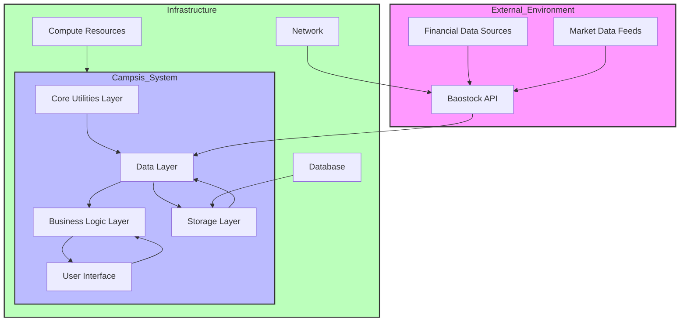
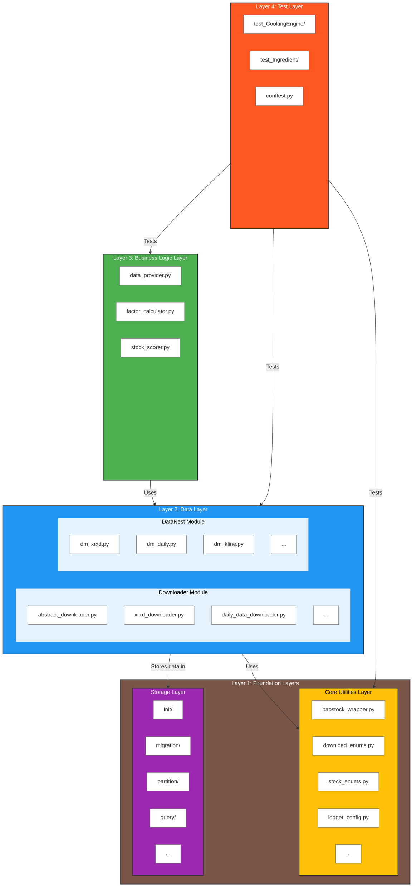

# Campsis Quantitative Trading System: Architecture Overview

## 1. System Overview

Campsis is a comprehensive quantitative trading system designed for financial data processing, analysis, and strategy development. It provides a structured framework for downloading, storing, and analyzing stock market data, with a focus on modularity, extensibility, and reliability.

### 1.1 Runtime Environment and Context

### 1.2 Overall Architecture Diagram

### 1.3 Layered Architecture Details

| Layer | Representative Modules | Additional Modules (Hover for Details) | Core Responsibility |
|-------|------------------------|---------------------------------------|---------------------|
| **Core Utilities** | baostock_wrapper.py, logger_config.py | download_enums.py, stock_enums.py, download_utils.py, package_manager.py | Provide fundamental utilities and shared resources |
| **Data Layer - Downloader** | abstract_downloader.py, xrxd_downloader.py | daily_data_downloader.py, kline_unified_downloader.py, stock_basic_downloader.py, stock_industry_downloader.py, trade_date_map_downloader.py, adjustment_factor_downloader.py | Download data from external sources |
| **Data Layer - DataNest** | dm_xrxd.py, dm_daily.py, dm_kline.py | dm_stock_basic.py, dm_stock_industry.py, dm_adjustment_factor.py, dm_trade_date.py, dm_global_dl_ctrl.py, dm_stock_seq.py, dm_generic_block_status.py, dm_base.py, dm_utils.py | Manage data storage and retrieval |
| **Business Logic** | data_provider.py, factor_calculator.py, stock_scorer.py | N/A | Implement core business logic for analysis |
| **Storage** | init/, migration/ | partition/, query/ | Provide data persistence and schema management |
| **Test** | test_CookingEngine/, test_Ingredient/ | conftest.py | Validate system functionality |

## 2. Architecture Design Background

### 2.1 Design Philosophy

The Campsis architecture is built upon the following core principles:

- **Modularity**: Decomposing the system into independent, reusable components
- **Separation of Concerns**: Clear division between data acquisition, processing, and storage
- **Abstraction**: Consistent interfaces for similar components
- **Testability**: Comprehensive test coverage to ensure system reliability
- **Scalability**: Ability to handle increasing data volumes and complexity

### 2.2 Design Inspiration

The architecture draws inspiration from several established design paradigms:

- **ETL Pipeline**: Data flows through distinct stages of extraction, transformation, and loading
- **Layered Architecture**: Clear separation of concerns across different functional layers
- **Component-Based Design**: Self-contained modules with well-defined responsibilities
- **Data-Centric Design**: Centralized data management with dedicated handlers
- **Test-Driven Development**: Comprehensive test coverage for all components

## 3. Architecture Layers

### 3.1 Core Utilities Layer (KitchenBase)

**Purpose**: Provides fundamental utilities and shared resources for the entire system.

**Core Components**:
- `baostock_wrapper.py`: Wraps Baostock API for financial data retrieval
- `download_enums.py`: Defines enumerations for download task types and statuses
- `stock_enums.py`: Defines enumerations for stock-related concepts
- `logger_config.py`: Configures logging for system monitoring and debugging
- `download_utils.py`: Common utilities for download operations
- `package_manager.py`: Manages package dependencies and installations

**Key Features**:
- API abstraction for external data sources
- Consistent logging across the system
- Reusable utility functions
- Standardized enumerations for system-wide use

### 3.2 Data Layer (Ingredient)

**Purpose**: Manages data acquisition, processing, and storage.

**Subcomponents**:

#### 3.2.1 Downloader Module
- `abstract_downloader.py`: Base class for all downloaders
- `xrxd_downloader.py`: Downloads dividend and bonus data
- `daily_data_downloader.py`: Downloads daily stock data
- `kline_unified_downloader.py`: Downloads K-line data
- `stock_basic_downloader.py`: Downloads basic stock information
- `stock_industry_downloader.py`: Downloads industry classification data
- `trade_date_map_downloader.py`: Downloads trade date mapping
- `adjustment_factor_downloader.py`: Downloads adjustment factors

#### 3.2.2 DataNest Module
- `dm_xrxd.py`: Manages dividend and bonus data storage
- `dm_daily.py`: Manages daily stock data storage
- `dm_kline.py`: Manages K-line data storage
- `dm_stock_basic.py`: Manages basic stock information storage
- `dm_stock_industry.py`: Manages industry classification storage
- `dm_adjustment_factor.py`: Manages adjustment factor storage
- `dm_trade_date.py`: Manages trade date information
- `dm_global_dl_ctrl.py`: Manages global download control and progress
- `dm_stock_seq.py`: Manages stock sequence information
- `dm_generic_block_status.py`: Manages block status information
- `dm_base.py`: Base class for all data managers
- `dm_utils.py`: Utilities for data management

**Key Features**:
- Abstract downloader interface for consistent behavior
- Data cleaning and validation
- Efficient data storage and retrieval
- Download progress tracking and resumption
- Error handling and logging

### 3.3 Business Logic Layer (CookingEngine)

**Purpose**: Implements core business logic for data analysis and strategy development.

**Subcomponents**:

#### 3.3.1 Picker Module
- `data_provider.py`: Provides data for analysis
- `factor_calculator.py`: Calculates financial factors
- `stock_scorer.py`: Scores stocks based on factors

**Key Features**:
- Data provision for analysis
- Factor calculation for investment strategies
- Stock scoring for selection
- Strategy evaluation and optimization

### 3.4 Storage Layer (database)

**Purpose**: Provides schema definitions and migration scripts for data persistence.

**Subcomponents**:
- `init/`: Initialization scripts for database tables
  - `base/`: Core tables (e.g., trade date map)
  - `download/`: Download-related tables (e.g., stock fixed sequence)
  - `kline/`: K-line data tables
  - `stock/`: Stock data tables (e.g., basic, daily, XRKD)
- `migration/`: Database migration scripts
- `partition/`: Table partitioning scripts
- `query/`: Utility queries

**Key Features**:
- Structured data storage
- Database schema management
- Migration support for versioning
- Optimized storage for performance

### 3.5 Test Layer (tests)

**Purpose**: Validates the functionality of all system components.

**Subcomponents**:
- `test_CookingEngine/`: Tests for business logic components
  - `test_Picker/`: Tests for picker module
- `test_Ingredient/`: Tests for data layer components
- `conftest.py`: Test configuration and fixtures

**Key Features**:
- Comprehensive test coverage
- Mocking for external dependencies
- Test fixtures for consistent test data
- Automated test execution

## 4. Architecture Flow

### 4.1 Data Flow

1. **Data Acquisition**: Downloaders retrieve data from external sources (e.g., Baostock API)
2. **Data Processing**: Raw data is cleaned, validated, and transformed
3. **Data Storage**: Processed data is stored in the database
4. **Data Retrieval**: Business logic components retrieve data for analysis
5. **Data Analysis**: Factors are calculated and stocks are scored
6. **Strategy Execution**: Investment strategies are evaluated and executed

### 4.2 Component Interaction

- **KitchenBase** provides utilities used by all other layers
- **Ingredient** uses KitchenBase utilities to download and manage data
- **CookingEngine** uses Ingredient components to access and analyze data
- **database** is accessed by Ingredient components for storage
- **tests** validate the functionality of all components

## 5. Core Design Patterns

### 5.1 Abstract Factory Pattern

Used in the downloader module, where `AbstractDownloader` provides a common interface for all concrete downloaders. This allows for consistent behavior across different data types while enabling easy addition of new downloaders.

### 5.2 Strategy Pattern

Used in the factor calculation and stock scoring components, where different strategies can be implemented and switched dynamically based on requirements.

### 5.3 Singleton Pattern

Used in various managers to ensure a single instance handles specific resources, such as logging configuration and download control.

### 5.4 Template Method Pattern

Used in the downloader module, where the base class defines the overall download process, and concrete classes implement specific steps.

### 5.5 Data Access Object Pattern

Used in the DataNest module, where each data manager provides a dedicated interface for accessing specific data types.

## 6. System Scalability

### 6.1 Horizontal Scalability

- **Modular Design**: New components can be added without disrupting existing functionality
- **Data Partitioning**: Database tables can be partitioned for improved performance
- **Parallel Processing**: Download tasks can be parallelized for faster data acquisition

### 6.2 Vertical Scalability

- **Optimized Storage**: Database schemas are designed for efficient storage and retrieval
- **Caching**: Frequently accessed data can be cached for improved performance
- **Batch Processing**: Large data sets can be processed in batches to reduce memory usage

## 7. System Reliability

### 7.1 Error Handling

- **Comprehensive Logging**: All operations are logged for debugging and monitoring
- **Graceful Degradation**: The system can continue functioning even if some components fail
- **Error Recovery**: Download progress is tracked, allowing resumption after failures

### 7.2 Data Integrity

- **Data Validation**: All data is validated before storage
- **Consistent Storage**: Data is stored in a structured, consistent format
- **Backup and Recovery**: Database backup and recovery mechanisms

## 8. System Extensibility

### 8.1 Adding New Data Types

- **Abstract Downloader**: New data types can be added by implementing the abstract downloader interface
- **Data Managers**: New data managers can be created for specialized data types
- **Database Schema**: New tables can be added for additional data types

### 8.2 Adding New Features

- **Factor Calculation**: New factors can be added to the factor calculator
- **Scoring Methods**: New scoring algorithms can be implemented
- **Strategies**: New investment strategies can be developed and tested

## 9. Architecture Advantages

1. **Modularity**: Clear separation of concerns enables easier maintenance and development
2. **Extensibility**: New features and data types can be added without disrupting existing functionality
3. **Reliability**: Comprehensive error handling and data validation ensure system stability
4. **Testability**: Extensive test coverage ensures code quality and facilitates refactoring
5. **Scalability**: The system can handle increasing data volumes and complexity
6. **Consistency**: Standardized interfaces and data formats ensure consistent behavior
7. **Flexibility**: The system can adapt to changing requirements and data sources

## 10. Architecture Disadvantages

1. **Complexity**: The layered architecture may introduce complexity in understanding the entire system
2. **Dependency Management**: Careful management of dependencies between layers is required
3. **Performance Overhead**: Abstraction layers may introduce minor performance overhead
4. **Learning Curve**: New developers may need time to understand the architecture
5. **Maintenance Overhead**: More components require more maintenance

## 11. Conclusion

The Campsis quantitative trading system architecture is a well-designed framework that balances modularity, extensibility, and reliability. By following established design patterns and best practices, it provides a solid foundation for financial data processing and strategy development. The layered structure ensures clear separation of concerns, while the modular design allows for easy extension and maintenance. With its comprehensive test coverage and error handling, the system is well-positioned to handle the demands of quantitative trading and investment analysis.

## 12. Future Enhancements

1. **Cloud Integration**: Support for cloud-based data storage and processing
2. **Real-time Data**: Integration with real-time market data sources
3. **Machine Learning**: Incorporation of machine learning models for prediction and optimization
4. **Visualization**: Interactive data visualization tools for strategy analysis
5. **API Endpoints**: RESTful API for external integration
6. **Containerization**: Docker support for consistent deployment
7. **Distributed Processing**: Support for distributed data processing for large datasets