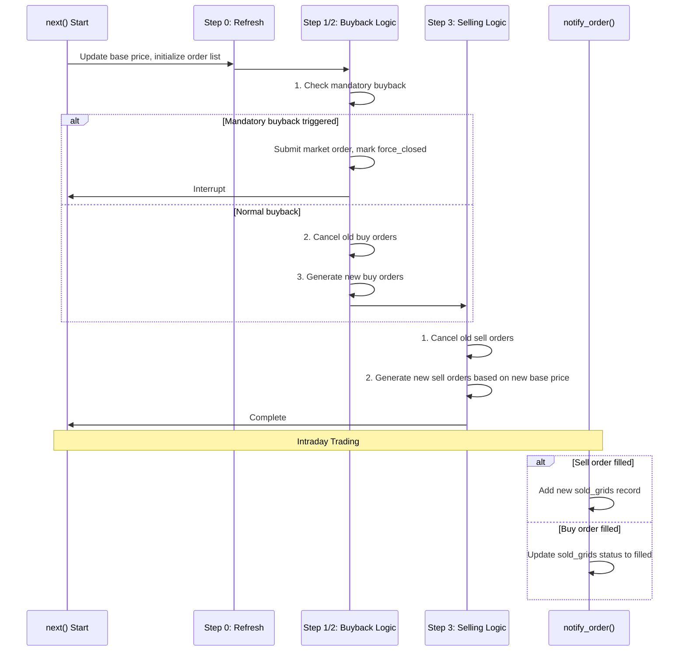

# Grid-Based Bear-Chasing Strategy Design Document

## Summary & Table of Contents

### Executive Summary

| Dimension | Description |
| :--- | :--- |
| **🎯 Strategy Positioning** | An active grid strategy that captures **rebound opportunities** in a **downtrend (bearish market)**. |
| **💡 Core Logic** | At the daily open, based on a dynamically adjusted base price, it **places multiple limit sell orders at different prices in one batch** (Static Multi-Order Parallel Model). It captures intraday rebound highs to sell holdings, then buys back at lower prices to add positions. |
| **⚙️ Workflow** | **Place Orders** → **Rebound Triggered** (Reduce Position) → **Price Pullback** (Buy Back to Add Position) |
| **🛡️ Risk Control** | - **Mandatory Buyback Mechanism**: Any sell position can be held for a maximum of 30 days. <br> - **Dynamic Base Price Downshift**: Only shifts down, following the bearish trend. <br> - **Consecutive Downshift Risk Control**: Pauses opening new sell orders if the base price shifts down for more than 3 consecutive days. |
| **📊 Applicable Scenarios** | ✅ Oscillating downtrend channels, pulsed rebounds, large-cap blue-chip stocks (sufficient liquidity). <br> ❌ Unilateral uptrends, unilateral decline without rebound, high-level oscillation. |

---

### Table of Contents

1.  **Strategy Core Elements**
    *   1.1. Strategy Name
    *   1.2. Core Mechanism
    *   1.3. Core Features
    *   1.4. Strategy Goals
    *   1.5. Applicable Scenarios
    *   1.6. Market Structural Fit & Adaptability
2.  **Strategy Design Philosophy**
3.  **Prerequisites**
4.  **Core Design Concept**
5.  **Generation and Update Mechanism of the Base Price**
    *   5.1. Core Design Principles
    *   5.2. Generation Mechanism
6.  **Global Data Structures**
7.  **Core Trading Process (in the `next()` Function)**
    *   Step 0: Preparation and Refreshment
    *   Step 1: Mandatory Buyback Check
    *   Step 2: Normal Buyback Logic
    *   Step 3: Selling Logic
    *   Step 4: Data Management and Cleanup
    *   Step 5: Base Price Dynamic Downshift
8.  **Order Lifecycle Management (`notify_order` Function)**
9.  **Core Process Sequence Diagram**
10. **Exception Handling and Boundary Cases**
    *   10.1. Risk Control Strategy for Consecutive Base Price Downshifts
    *   10.2. Handling of Other Boundary Cases
11. **Core Parameters and Risk Control**
    *   11.1. Core Parameter Definition
    *   11.2. Order Type Specification
    *   11.3. Risk Control Mechanism Summary
12. **Strategy Potential Risks and Mechanism Vulnerabilities**
    *   12.1. Intraday Dynamic Order Placement Missing Risk
    *   12.2. Logic Conflict Between Base Price Update and Current Day's Sell Orders

---

This document details the core logic of the **Grid-Based Bear-Chasing Strategy (网格追空策略)**. The strategy is based on a "Static Multi-Order Parallel Model", aiming to capture rebound opportunities in a downtrend and maximize the efficiency of capturing intraday volatility through multiple pre-placed limit sell orders. The term "Bear-Chasing" refers to actively tracking the structural profit opportunities within a bear market, rather than engaging in high-risk short-selling.

---

## 1. Strategy Core Elements

### 1.1 Strategy Name
**Grid-Based Bear-Chasing Strategy** (网格追空策略)
*   **Name Definition**: "Bear-Chasing" refers to the strategy's active pursuit of profit opportunities in a **bear market (空头市场)**. It is **not** a high-risk short-selling strategy, but rather a tactical operation based on existing long positions.

### 1.2 Core Mechanism
In a downtrend (bearish market), the strategy first establishes an initial base position by allocating a portion of its total capital. It then operates under the "Static Multi-Order Parallel" model: at the start of each trading day, it batches multiple limit sell orders at staggered prices based on the reference price P_base. When a price rebound triggers a sell order, the strategy passively reduces its position by selling a portion of its holdings. Subsequently, as the price declines, it re-adds the position via pre-calculated limit buy orders. This "sell-to-reduce, buy-to-add" cycle locks in profits from price oscillations while preserving a core long exposure over the long term.

### 1.3 Core Features
- **Efficient Volatility Capture**: By placing N sell orders daily, it maximizes the opportunity to capture consecutive intraday rises, compensating for the inefficiency of the "single-order model".
- **Dynamic Base Price Downshift**: The base price `P_base` dynamically follows the market downshift, maintaining the strategy's bearish aggressiveness.
- **One-to-One Hedging**: Every sell order (reduce position) is bound to a buy order (add position), forming an independent trading loop.
- **Mandatory Risk Hedging**: The `mandatory_buyback_days` mechanism ensures that any sell position's holding period has an upper limit, preventing losses in extreme market conditions.

### 1.4 Strategy Goals
| Goal Type | Specific Objective | Description |
| :--- | :--- | :--- |
| **Core Profit Goal** | Long-term Cash Flow Generation | Based on the structural characteristic of "short bull, long bear" markets, the strategy focuses on generating consistent long-term cash profits. It does **not** deliberately pursue short-term increases in total assets; instead, it strategically captures the "sell high, buy low" cycles in prolonged bear markets to continuously accumulate cash returns. |
| **Risk Control Goal** | Limit Maximum Holding Period | Use the `mandatory_buyback_days` mechanism to ensure that any sell-to-reduce trade is forcibly closed within a predefined period (e.g., 30 days), preventing the risk of unlimited losses caused by a single trade being trapped in a continued uptrend. |
| **Risk Control Goal** | Adapt to Market Downtrend | Dynamically adjust the base price downward following the market's downtrend, ensuring that the strategy's sell orders are always placed at higher relative prices, maintaining the strategy's "follow the trend" ability. |
| **Position Management Goal** | Maintain Core Long Exposure | While capturing short-term trading opportunities, always ensure a core long position is maintained. The trading of reducing and adding positions is a tactical overlay on the strategic long-term holding. |
| **Execution Efficiency Goal** | Maximize Volatility Capture Efficiency | Use the "Static Multi-Order Parallel" model to place multiple sell orders at different prices at one time, improving the probability of capturing intraday rebounds and maximizing the utilization of volatile opportunities. |

### 1.5 Applicable Scenarios
| Suitable | Unsuitable |
| :--- | :--- |
| ✅ The target is in a clear **oscillating downtrend channel** | ❌ **Continued unilateral uptrend** market |
| ✅ **Pulsed rebounds** exist in the downtrend | ❌ Market with unilateral decline but **no rebound** |
| ✅ Target has **sufficient liquidity** (e.g., large-cap blue-chip stocks) | ❌ **High-level oscillation with unclear direction** |

### 1.5 Market Structural Fit & Adaptability

This strategy's performance is highly dependent on the structural characteristics of the target market. It thrives in specific market environments and struggles in others. The following table summarizes its adaptability across different markets:

| Market | Structural Fit | Adaptability | Rationale |
| :--- | :--- | :--- | :--- |
| **A-Share Market (中国A股)** | ✅ **Highly Suitable** | ⭐⭐⭐⭐⭐ | The classic structure of "short bull, long bear" (牛短熊长) is the ideal environment: <br>1. **Long Bear**: Provides continuous "sell high — buy low" cycles as the base price shifts down. <br>2. **Sharp Rallies**: Offers frequent and explosive rebound opportunities for the batch of sell orders to be triggered. |
| **Hong Kong Stock Market (港股)** | ⚠️ **Partially Suitable** | ⭐⭐⭐ | Similar to A-shares, it can exhibit a volatile, range-bound nature. However, the lower liquidity compared to A-shares (especially for small caps) and greater influence by overseas capital flows may cause slippage during mandatory buybacks. The strategy works better for large-cap stocks. |
| **U.S. Stock Market (美股)** | ❌ **Unsuitable** | ⭐ | The dominant "slow bull" (慢牛) structure, where prices tend to drift upward over the long term without significant pullbacks, is hostile. The **"buyback" phase is permanently missing**, causing the profit loop to break and resulting in potential unlimited losses on sell positions. |
| **European Markets** | ❌ **Unsuitable** | ⭐ | Similar to the U.S., European markets often exhibit a secular upward trend with lower volatility. The lack of sustained bear markets and sharp, frequent rebounds makes the strategy's long-term profit accumulation highly challenging. |
| **Cryptocurrency Market (加密货币)** | ⚠️ **High Risk / Partially Suitable** | ⭐⭐ | While crypto markets offer extreme volatility (which is good for rebound selling), their unpredictable nature, potential for infinite squeezes, and often shallow liquidity make the risk of unlimited losses and slippage during mandatory buybacks extremely high. It requires very strict risk management. |

---

## 2. Strategy Design Philosophy

The core philosophy of this strategy is **"Follow the trend to sell high, earn from volatility"**. It is not an ordinary grid that passively earns low prices in an oscillating market, but an **active strategy that uses rebounds in a downtrend (bearish) as trading opportunities**.

*   **Follow the trend**: Being in an **oscillating downward channel** is the premise and safety net of the strategy. Market inertia will continuously push the price down, making the high sell-then-low buy (add position) have higher win rates and certainty.
*   **Profit from volatility**: In a downtrend, price inevitably comes with rebounds. The strategy aims to capture these "pulsed rebounds", reducing positions (selling) at high points and cashing in profits (buying back) using market inertia.
*   **Risk hedging**: Every sell (reduce position) immediately locks in its corresponding target buyback price, forming a trading loop. This allows the strategy to automatically realize profits via price pullbacks without judging the market's end point.

---

## 3. Prerequisites

To ensure the strategy functions as designed, the following prerequisites must be met:

### 3.1 Target Market & Liquidity
*   **Trading Targets**: The strategy is designed for **A-share large-cap blue-chip stocks** (e.g., SSE 50, CSI 300 constituents).
*   **Liquidity Assumption**: High market liquidity is assumed. The strategy does **not** account for slippage, order placement failures, or market impact caused by illiquidity.

### 3.2 Trading Rules & Mechanisms
*   **Lot Size**: All buy and sell orders must be multiples of **100 shares (1 lot)**.
*   **Initial Position Establishment**: The strategy requires the establishment of an **initial base position** at the start. A predetermined proportion of the total capital (e.g., 40%) must be allocated to purchase the target stock to enable subsequent sell operations.
*   **Sufficient Capital**: Adequate capital must be available in the trading account to support the strategy's buyback (position adding) operations.

### 3.3 Technical Framework Requirements
*   **State-Driven Execution**: The strategy requires a **state-driven trading framework** (e.g., Backtrader, Zipline) that supports event-driven, bar-by-bar execution.
*   **Dynamic Order Management**: The framework must support dynamically placing, canceling, and updating orders *within* the main strategy logic (e.g., the `next()` method).
*   **Order Lifecycle Tracking**: The framework must provide an order lifecycle callback (e.g., `notify_order`) to allow the strategy to react to order status changes (filled, canceled, rejected).
*   **Path Dependency**: The framework must support maintaining internal state across trading sessions to handle path-dependent logic (e.g., counting consecutive days, tracking grid status).

---

## 4. Core Design Concept

*   **Goal**: Solve the problem of "missing consecutive intraday rises due to only placing orders on a single day".
*   **Model**: **Static Multi-Order Parallel Model**. At the beginning of each trading day (when the `next()` function executes), based on the latest base price `P_base`, it calculates and places `N` future limit sell orders at once. Simultaneously, it uniformly checks and places limit buy orders for all grids pending buyback.
*   **Mechanism**: Utilize Backtrader's daily matching engine. When the `High` price of a single K-line touches the sell order limit, it is automatically determined as a transaction; when the `Low` price touches the buy order limit, it is automatically determined as a transaction.

---

## 5. Generation and Update Mechanism of the Base Price

The base price is the only anchor point for the grid strategy to calculate all order prices. Drawing on the design philosophy of **Grid-Based Bear-Chasing Strategy**, this strategy adopts a **dynamic downshift mechanism**, so that the base price always follows the channel center of the downtrend, thereby improving the strategy's adaptability.

### 5.1 Core Design Principles
*   **Down Only**: The base price only shifts down when the price drops, and never shifts up due to rebounds. This ensures the strategy's "follow the trend" in a bearish market.
*   **Dynamic Following**: The base price is not a fixed value, but a "moving floor" that always follows the market's downward trend.
*   **Threshold Trigger**: Only when the price drops below a certain threshold (`base_shift_threshold`), will the base price shift down, to avoid frequent adjustments caused by daily fluctuations.

### 5.2 Generation Mechanism
*   **Initialization**:
    *   **Timing**: On the first day of strategy start-up.
    *   **Price**: Get the **previous closing price** of the current target as the initial base price.
        *   `self.base_price = self.data.close[-1]`
*   **Daily Update (Dynamic Downshift)**:
    *   **Timing**: At the end of the daily `next()` function (i.e., after all order processing is completed).
    *   **Logic**:
        1.  Get today's closing price `today_close = self.data.close[0]`.
        2.  Calculate the trigger threshold: `threshold = self.base_price * (1 - self.params.base_shift_threshold)`.
        3.  **Judgment and Update**:
            *   If `today_close < threshold` (i.e., the closing price drops enough below the base price), shift the base price down to `today_close`.
            *   Otherwise, the base price remains unchanged.
        4.  **Formula**:
            ```python
            if self.data.close[0] < self.base_price * (1 - self.params.base_shift_threshold):
                self.base_price = self.data.close[0]
            ```
        5.  **Purpose**: The updated base price will be used for the next trading day's order calculation, ensuring that the current day's orders are based on the previous day's base price, avoiding logical conflicts.

---

## 6. Global Data Structures

*   **Active Sell Order List (`self.active_sell_orders`)**: Stores limit sell orders that have been submitted but not yet settled on the current day.
*   **Active Buy Order List (`self.active_buy_orders`)**: Stores limit buyback orders that have been submitted but not yet settled on the current day.
*   **Sold Grid List (`self.sold_grids`)**: Stores information about all grids that have been successfully sold but not yet completed buyback.
    *   **Grid Record Structure**:
        ```python
        {
            'grid_id': int,             # Grid unique identifier
            'sell_price': float,        # Sell execution price
            'sell_shares': int,         # Number of shares sold
            'sell_date': datetime.date, # Sell execution date
            'base_price_snapshot': float, # Base price snapshot at the time of selling (used for buyback price calculation)
            'buy_price_target': float,   # Target buyback price
            'status': 'pending_buy',    # Grid status: 'pending_buy' | 'filled' | 'force_closed'
            'buy_date': datetime.date,  # Buyback execution date
            'buy_price_actual': float,  # Actual buyback execution price
            'force_loss': float         # Loss amount from forced closing         
        }
        ```

---

## 7. Core Trading Process (in the `next()` Function)

The execution order of the `next()` function must be strictly defined to ensure logical rigor and state consistency.

### Step 0: Preparation and Refreshment
*   **[0.1] Order Queue Initialization**: Prepare to handle orders left over from yesterday. (Note: Base price update is moved to the end)

### Step 1: Mandatory Buyback Check (Highest Priority)
*   **[1.1] Status Scan**: Traverse `self.sold_grids` to find grids with `status == 'pending_buy'` that exceed `mandatory_buyback_days`.
*   **[1.2] Execution**:
    *   **Share Adjustment**: Adjust `grid['sell_shares']` to an **integer multiple of 100 shares** (rounded down).
    *   **Order Placement**: Submit a market order for forced liquidation.
*   **[1.3] Update**: Change status to `'force_closed'`.
*   **[1.4] Termination**: Return after execution and no longer execute subsequent logic.

### Step 2: Normal Buyback Logic
*   **[2.1] Old Buy Orders Expire**: Cancel all unfilled limit buy orders in `self.active_buy_orders`.
*   **[2.2] Generate New Buy Orders**:
    *   Traverse grids with `status == 'pending_buy'` in `self.sold_grids`.
    *   **Price Calculation**: Calculate the buyback price based on its `base_price_snapshot` (locked at the time of selling to avoid interference from base price changes).
    *   **Share Adjustment**: Adjust `grid['sell_shares']` to an **integer multiple of 100 shares** (rounded down).
    *   **Order Placement**: Submit a new limit buy order and add it to `self.active_buy_orders`.

### Step 3: Selling Logic
*   **[3.1] Old Sell Orders Expire**: Cancel all unfilled limit sell orders in `self.active_sell_orders`.
*   **[3.2] Generate New Sell Orders**:
    *   Based on the **current `self.base_price`** (i.e., the base price calculated from yesterday's closing price), calculate N new sell grid prices.
    *   **Share Calculation and Adjustment**:
        *   Calculate the target number of shares for each grid based on the grid spacing and available funds.
        *   Adjust the target number of shares to an **integer multiple of 100 shares** (rounded down). If the adjusted number of shares is 0, skip that grid.
    *   **Order Placement**: Submit a new limit sell order and add it to `self.active_sell_orders`.

### Step 4: Data Management and Cleanup
*   **[4.1] Status Cleanup**: Clean up expired records in `self.sold_grids` where `status` is `'filled'` or `'force_closed'`.

### Step 5: Base Price Dynamic Downshift (Daily Update)
*   **[5.1] Update Base Price**: Execute the base price dynamic downshift logic (see Section 5.2 for details). This operation does not affect today's orders, and is only prepared for the next trading day.

---

## 8. Order Lifecycle Management (`notify_order` Function)

The `notify_order` function only serves as a **status updater** and does not generate any new orders.

*   **Sell Order Completed (`Completed`)**:
    *   Remove from `self.active_sell_orders`.
    *   Create a new record in `self.sold_grids`, with status marked as `'pending_buy'`.
    *   Log recording.
*   **Buy Order Completed (`Completed`)**:
    *   Remove from `self.active_buy_orders`.
    *   Find the corresponding record in `self.sold_grids` and update its status to `'filled'`.
    *   Log recording.
*   **Order Canceled/Rejected (`Canceled`/`Rejected`)**:
    *   Remove from the active order list and record the log.

---

## 9. Core Process Sequence Diagram



---

## 10. Exception Handling and Boundary Cases

This section focuses on describing the strategy's handling logic under extreme or abnormal market conditions, especially the risk control strategy for consecutive base price downshifts.

### 10.1 Risk Control Strategy for Consecutive Base Price Downshifts

*   **Risk Description**:
    *   When the target is in a unilateral downtrend, the base price will shift down daily (based on the closing price), causing the daily sell grid price to also decrease.
    *   The strategy will place sell orders at increasingly lower prices. If the market continues to fall without rebounding, these sell orders will continue to be executed, causing the strategy to establish a large number of short positions at low levels.
    *   Once the market rebounds at low levels, these short positions will face huge unrealized loss risks.
*   **Risk Control Strategy**:
    *   **Core Idea**: By monitoring the frequency and magnitude of base price downshifts, proactively intervene in extreme downtrends to control risks.
    *   **Specific Measures**:
        1.  **Add Consecutive Downshift Counter**:
            *   In the `self.base_price` update logic, add a counter `self.consecutive_down_days`.
            *   If the base price shifts down today, the counter `+1`; otherwise, reset to zero.
        2.  **Set Threshold to Trigger Risk Control**:
            *   **Pause Selling**: If `self.consecutive_down_days` exceeds `max_down_days_to_sell` (e.g., 3 days), pause the generation of new sell orders. At this point, the strategy only handles buyback orders and no longer opens new short positions.
            *   **Accelerate Buyback**: Consider increasing the density of buyback grids during the consecutive downshift period of the base price (i.e., reduce `grid_down_ratio`) to lock in short profits faster, even if the price only fluctuates slightly, it can close the position.
        3.  **Code Implementation Location**:
            *   The counter update logic should be implemented in Step 5 (Base Price Dynamic Downshift) of Chapter 7.
            *   The risk control check should be performed at the beginning of Step 3 (Selling Logic) of Chapter 7.

### 10.2 Handling of Other Boundary Cases
*   **Limit Up / Limit Down**:
    *   When the target hits the limit up, sell orders may not be filled.
    *   When the target hits the limit down, buy orders (including market orders for mandatory buyback) may not be filled.
    *   The strategy needs to handle order rejection or failure scenarios, for example, if mandatory buyback fails, it may need to be retried on the next trading day, or increase slippage tolerance.
*   **Extreme Lack of Liquidity**:
    *   In extreme market conditions, even large-cap blue-chip stocks may experience liquidity issues.
    *   The strategy should consider market depth when forcibly buying back, potentially splitting a large order into multiple small orders for batch execution.
*   **Holidays / Trading Suspension**:
    *   Encountering holidays or trading suspensions, the strategy should be paused and reinitialize the base price and order queue upon resumption of trading.

---

## 11. Core Parameters and Risk Control

### 11.1 Core Parameter Definition

To clearly show the key parameters affecting strategy performance, the following table details them:

| Parameter Name | Variable Name | Type | Default Value | Description and Impact |
| :--- | :--- | :--- | :--- | :--- |
| **Initial Position Ratio** | `initial_position_ratio` | float | 0.4 (40%) | **Definition**: The ratio of funds used for grid trading to total funds. <br>**Impact**: **Too high (>60%)** has high capital efficiency but weak risk resistance; **Too low (<20%)** is very safe but has no obvious returns. <br>**Suggestion**: Conservative 30-40%, Aggressive 40-50%. |
| **Grid Upward Spacing** | `grid_up_ratio` | float | 0.03 (3%) | **Definition**: The price spacing between sell grids. <br>**Impact**: The smaller the spacing, the denser the order placement, the stronger the ability to capture volatility, but the greater the risk of rapid full position on a unilateral uptrend. |
| **Grid Buyback Price Difference** | `grid_down_ratio` | float | 0.05 (5%) | **Definition**: The decline amplitude of the buyback price relative to the sell price. <br>**Impact**: The larger the amplitude, the higher the single profit, but the more difficult the buyback transaction, the longer the holding period, and the greater the risk of facing a rebound. |
| **Parallel Order Quantity** | `num_grids` | int | 5 | **Definition**: The number of sell orders placed simultaneously per day. <br>**Impact**: The larger the quantity, the stronger the ability to capture the rally on a single day, but the more capital it occupies, and the higher the risk that all orders are triggered (full position reduction). |
| **Mandatory Buyback Days** | `mandatory_buyback_days` | int | 30 | **Definition**: The maximum number of trading days that a sell grid (sell order) can hold after being executed. <br>**Impact**: **The only safety fuse**. The shorter the days, the smaller the risk exposure, but frequent mandatory buybacks (stop loss) may be triggered in a weak oscillating market. |

### 11.2 Order Type Specification

To balance profitability and risk control, the strategy adopts different order types in different scenarios:

*   **Normal Trading Scenarios**
    *   **Goal**: Precise pricing, cost control.
    *   **Sell Orders**: **Limit Order**. Passive sell orders are placed at preset grid prices to ensure execution at the target price or higher.
    *   **Buy Orders**: **Limit Order**. Passive buy orders are placed at the corresponding target buyback prices to ensure execution at the target price or lower, locking in profits.
*   **Forced Trading Scenarios**
    *   **Goal**: Immediate execution, risk removal.
    *   **Mandatory Buyback Orders**: **Market Order**. When a timeout or risk warning is triggered, to ensure immediate position closing, the market price is unconditionally accepted to control further losses.

### 11.3 Risk Control Mechanism Summary
*   **Core Risk**: The biggest risk of this strategy is a **unilateral uptrend**. After all sell orders are filled, if the price continues to not fall back, it will lead to capital exhaustion, eventually triggering forced liquidation or a liquidity crisis.
*   **Control Measures**:
    1.  **Initial Position Control**: Limit total risk exposure through `initial_position_ratio`.
    2.  **Mandatory Buyback Mechanism**: Use `mandatory_buyback_days` as the last line of defense to lock losses within an acceptable range. Market orders are used for mandatory buybacks to ensure quick execution.
    3.  **Grid Parameter Configuration**: Reasonably configure `grid_up_ratio` and `num_grids` to avoid excessive order placement leading to rapid full positions.
    4.  **Liquidity Crisis Response Mechanism**:
        *   **Real-time Liquidity Monitoring**: Continuously monitor the bid/ask spread and order book depth. If the spread exceeds a certain threshold (e.g., `max_spread_ratio`) or the volume is critically low, the strategy should automatically pause trading.
        *   **Forced Liquidation via Market Orders**: When a liquidity crisis is triggered (e.g., limit down, extreme spread), the strategy should prioritize exiting positions. It must use market orders to ensure execution, accepting high slippage as a cost of risk control.
        *   **Sliced Execution**: For large positions, split forced liquidation orders into multiple smaller market orders to minimize market impact and improve the probability of filling at a reasonable price.

---

## 12. Strategy Potential Risks and Mechanism Vulnerabilities

This section is dedicated to recording potential mechanism vulnerabilities found during the strategy design process. These vulnerabilities may affect the actual operation performance of the strategy and require focused attention during the code implementation phase.

### 12.1 Intraday Dynamic Order Placement Missing Risk
*   **Problem Description**:
    *   In the current design, the `next()` function is responsible for uniformly placing buy orders for all grids with `pending_buy` status daily. The `notify_order` function only updates the status to `pending_buy` when a sell order is executed.
    *   **Vulnerability Point**: If a sell order is executed intraday, its status becomes `pending_buy`, but its buy order must wait until the next `next()` function runs to be generated. This means that during the remaining trading time after execution, the strategy is in a "naked" state (having reduced a position without a corresponding buy order for risk hedging).
*   **Risk Assessment**:
    *   **High Risk**: In extreme market conditions, violent intraday price fluctuations may lead to margin shortages, increasing the risk of being forced to liquidate.
*   **Follow-up Optimization Direction**:
    *   Add an **immediate generation of corresponding limit buy orders** mechanism in the sell order execution logic of the `notify_order` function to achieve a real-time closed loop of "one sell locks one buy".

### 12.2 Logic Conflict Between Base Price Update and Current Day's Sell Orders
*   **Status**: Resolved
*   **Solution**: Shift the dynamic downshift timing of the base price from before daily order placement (start of `next()`) to after daily order placement (end of `next()`). This ensures that all orders on the current day (especially sell orders) are calculated based on the **previous day's base price**, avoiding the logical contradiction of "sell order target price being lower than the price that has occurred".